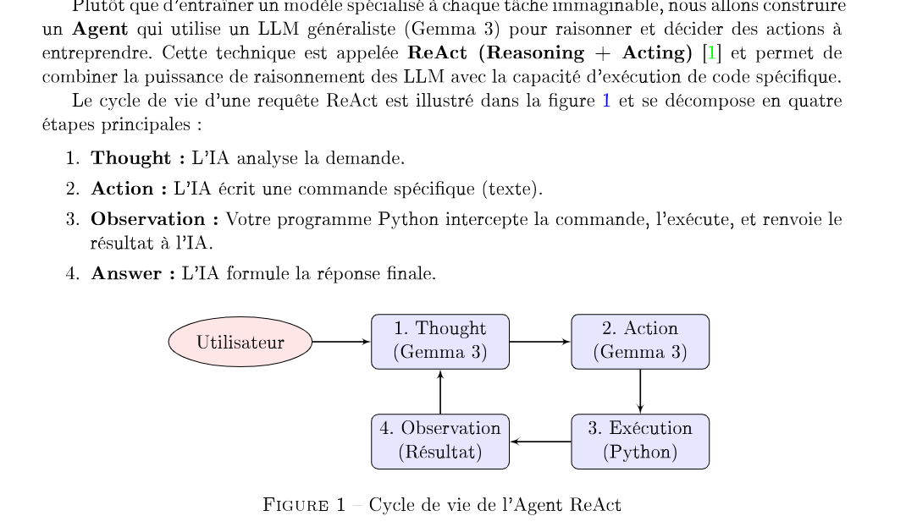

# Intro

Agent IA est un modèle de langage qui apelle une API, tout simplement  
.. sous forme de liste avec la signature (nom et paramètre type)
Chaine de pensée possède d'avantage de jetons 

Mission : créer un env virtuel avec 4 étapes de l'image, pour permettre à l'IA de réagir dans notr env virtuel (smart home code).



Sortie de chauqe fonctions doit etre une chaine de cara

# Etapes

## Phase 1

Créer un env en simulant un e maison co  
A nous d'apprendre à use fonctions via le Prompt Système et la boucle d'exécution  

- Coder classe et méthodes

## Phase 2

Pour le ReAct doit def un Prompt Sytème explique coment agir

- Compléter la fonction du prompt

Fait des boucles ou il analys jusqu'à avoir assez d'infos pour rép 

- Compléter la boucle avec les détails et fonctions nécessaires

## Phase 3 

Tester en faisant une modif à notre objet 

- Modifier la classe et permettre à l'agent de le comprendre
- Ajouter une fonction qui indique les pièces pour voir les nouvelles par ex

Automatiser l'accès aux détails de la structure pour l'agent 
- Créer une fonction qui indique les méthodes etc 

## Phase 4

- effectuer les tests
- observer les limites 

# Modifications et Concepts Principaux

## Modifications
1. **smart_home.py**: Ajout des méthodes pour contrôler les lumières et obtenir la température.
   - `get_light_state(room)`: Retourne l'état de la lumière dans une pièce.
   - `light_on(room)`: Allume la lumière dans une pièce.
   - `light_off(room)`: Éteint la lumière dans une pièce.
   - `get_temperature(room)`: Retourne la température dans une pièce.

2. **agent.py**: Création d'une fonction pour interagir avec la classe SmartHome.
   - `control_home(action, room)`: Gère les actions sur la maison intelligente.

---

# 📋 RÉSUMÉ COMPLET DU TP

## Sujet et Fonctionnement

Ce TP2 construit un **agent autonome basé sur LLM** capable d'interagir avec une maison domotique virtuelle. L'objectif est d'implémenter les **4 étapes du pipeline agent** :

1. **Étape 1** : Conception du système physique (SmartHome)
2. **Étape 2** : Conception du Prompt Système 
3. **Étape 3** : Boucle d'exécution (interaction agent-environnement)
4. **Étape 4** : Tests et observation des limites

### Architecture du Système

```
Utilisateur → Input en français
    ↓
Historique + Prompt Système + Input
    ↓
Modèle LLM (Gemma) → Pense & Répond
    ↓
Parsing (détection d'actions)
    ↓
Exécution (appel des méthodes SmartHome)
    ↓
Observation (retour du système)
    ↓
Ajout à l'historique
    ↓
Réponse finale à l'utilisateur
```

---

## 🚀 CONCEPTS PRINCIPAUX DÉTAILLÉS

### 1. ReAct (Reasoning + Acting + Observing)

**ReAct est un framework révolutionnaire** qui permet à un agent LLM d'alterner entre :

- **Reasoning** : Réfléchir et planifier l'action
- **Acting** : Exécuter une action dans l'environnement  
- **Observing** : Recevoir le retour et adapter le comportement

#### Cycle ReAct Complet en 5 Étapes

```
STEP 1 : Pensée (Reasoning)
├─ Input: "Allume la cuisine"
├─ Processus: L'IA analyse la demande
└─ Output: "Je vais allumer. [light_on](cuisine)"

STEP 2 : Parsing (Detection)
├─ Regex détecte: [light_on](cuisine)
├─ Extraction: action='light_on', argument='cuisine'
└─ Validation: vérifier que l'action existe

STEP 3 : Action (Acting)
├─ Exécution: home.light_on('cuisine')
├─ Résultat: "La lumière dans cuisine est allumée."
└─ État modifié

STEP 4 : Observation (Observing)
├─ Retour du système capturé
├─ Ajout à l'historique
└─ Signal de succès

STEP 5 : Réflexion & Décision
├─ L'agent apprend du retour
├─ Décide si d'autres actions sont nécessaires
└─ Prépare la réponse finale à l'utilisateur
```

#### Avantages de ReAct

✅ **Transparence** : On voit le processus de pensée de l'IA  
✅ **Robustesse** : Capable de corriger ses erreurs  
✅ **Scalabilité** : Gère les tâches complexes multi-étapes  
✅ **Traçabilité** : Facile à déboguer et comprendre  
✅ **Flexibilité** : S'adapte à différents environnements  

#### Comparaison avec d'autres approches

| Approche | Transparence | Fiabilité | Complexité |
|----------|-------------|-----------|-----------|
| Simple | ❌ | ⭐⭐ | ⭐ |
| Chain-of-Thought | ⭐⭐⭐ | ⭐⭐⭐ | ⭐⭐ |
| ReAct | ⭐⭐⭐⭐ | ⭐⭐⭐⭐ | ⭐⭐⭐ |

---

### 2. Prompt Système (System Prompt)

Le **prompt système** est l'**instruction fondamentale** qui définit le comportement complet de l'IA. C'est la "constitution" de l'agent.

#### Composants Essentiels

```markdown
1. RÔLE ET PERSONNALITÉ
   "Tu es un assistant domotique intelligent connaissant les bonnes pratiques..."

2. OBJECTIFS CLAIRS
   "Ton rôle est de comprendre les demandes et contrôler la maison..."

3. OUTILS DISPONIBLES (avec descriptions)
   - light_on(room): Allume les lumières (salon, cuisine, chambre)
   - light_off(room): Éteint les lumières
   - get_light_state(room): Vérifie l'état actuel
   - get_temperature(room): Retourne la température

4. FORMAT D'ACTION ATTENDU
   "Utilise TOUJOURS le format [TOOL](argument)"
   Exemple: [light_on](cuisine)

5. CONTRAINTES ET LIMITES
   - Max 5 actions par requête utilisateur
   - Valide toujours que la pièce existe
   - Pièces disponibles: salon, cuisine, chambre

6. COMPORTEMENT EN CAS D'ERREUR
   - Propose une alternative
   - Demande clarification à l'utilisateur
   - Explique pourquoi l'action a échoué
```

#### Impact du Prompt Système

- **80% du comportement** de l'agent dépend du prompt
- Détermine la **qualité et la fiabilité** des réponses
- Peut transformer un comportement mauvais en excellent
- Permet de **"programmer" sans coder**

#### Types de Prompts

**Prompt Statique (Fixed)** :
- Défini une seule fois au démarrage
- Même pour tous les utilisateurs
- Simple mais moins flexible

**Prompt Dynamique (Adaptive)** :
- S'adapte aux outils disponibles
- Change si on ajoute/retire des outils
- S'adapte au contexte utilisateur

#### Techniques de Prompt Engineering

| Technique | Exemple | Bénéfice |
|-----------|---------|----------|
| **Role Playing** | "Tu es un expert en domotique..." | Améliore la qualité |
| **Few-shot Learning** | Fournir des exemples | Meilleur format de sortie |
| **Chain-of-Thought** | "Réfléchis étape par étape" | Meilleur raisonnement |
| **Constraints** | "Max 5 actions" | Évite les abus |
| **Clarification** | "Pose une question si ambigu" | Meilleure UX |

---

## 📊 Tableau Récapitulatif Final

| Aspect | Description |
|--------|-------------|
| **Framework** | ReAct (Reasoning + Acting + Observing) |
| **Environnement** | Maison domotique virtuelle (3 pièces) |
| **LLM Utilisé** | Gemma 3.4B via Ollama |
| **Format Actions** | [TOOL](argument) |
| **Mémoire** | Historique de conversation structuré |
| **Limite Steps** | Max 5 itérations par requête |
| **Tests** | 5 tests automatiques inclus |

---

## 🎯 Conclusion

Ce TP démontre les **concepts fondamentaux des agents autonomes basés sur LLM**. Les techniques utilisées (ReAct, Prompt Engineering, Memory Management) sont directement applicables à :
- Assistants vocaux (Alexa, Google Home)
- Chatbots d'entreprise
- Robots autonomes
- Systèmes de recherche avancés
- 