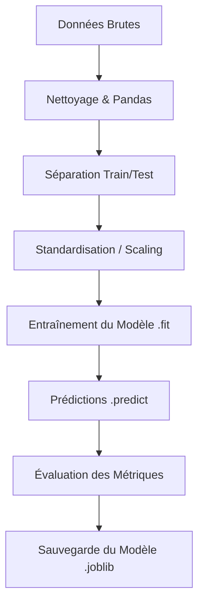

# 🧠 Pense-Bête : Commandes Principales du Machine Learning

Ce document regroupe les commandes Python essentielles pour réaliser un projet de Machine Learning de A à Z avec les bibliothèques **Scikit-Learn**, **Pandas**, **NumPy** et **Joblib**.

---

## 📋 Table des Matières
1. [Workflow Global du Machine Learning](#-workflow-global-du-machine-learning)
2. [Préparation et Prétraitement des Données](#-préparation-et-prétraitement-des-données)
3. [Apprentissage Supervisé : Classification](#-apprentissage-supervisé--classification)
4. [Apprentissage Supervisé : Régression](#-apprentissage-supervisé--régression)
5. [Évaluation des Modèles](#-évaluation-des-modèles)
6. [Sauvegarde et Chargement des Modèles](#-sauvegarde-et-chargement-des-modèles)

---

## 🔄 Workflow Global du Machine Learning



---

## 📊 Préparation et Prétraitement des Données

Avant d'entraîner un modèle, il faut charger, diviser et mettre à l'échelle les données.

### 1. Charger et inspecter les données (Pandas)
```python
import pandas as pd

# Charger un fichier CSV
df = pd.read_csv('data.csv')

# Afficher les 5 premières lignes
print(df.head())

# Obtenir des informations sur les colonnes et types
print(df.info())

# Statistiques descriptives de base (moyenne, écart-type, min, max...)
print(df.describe())
```

### 2. Séparer les caractéristiques (X) et la cible (y)
```python
# X : les variables explicatives (toutes les colonnes sauf 'cible')
X = df.drop(columns=['cible'])

# y : la variable que le modèle doit prédire
y = df['cible']
```

### 3. Diviser en données d'entraînement et de test
> [!IMPORTANT]
> Il faut toujours évaluer un modèle sur des données qu'il n'a pas vues pendant son entraînement pour mesurer sa capacité de généralisation.
```python
from sklearn.model_selection import train_test_split

# 80% d'entraînement, 20% de test
X_train, X_test, y_train, y_test = train_test_split(
    X, y, 
    test_size=0.2, 
    random_state=42  # Assure la reproductibilité du découpage
)
```

### 4. Normalisation / Standardisation (Feature Scaling)
Certains algorithmes basés sur la distance (ex: KNN, SVM) nécessitent que toutes les variables soient à la même échelle.
```python
from sklearn.preprocessing import StandardScaler

scaler = StandardScaler()

# fit_transform calcule la moyenne/variance ET transforme les données d'entraînement
X_train_scaled = scaler.fit_transform(X_train)

# transform applique uniquement les paramètres calculés sur l'entraînement aux données de test
X_test_scaled = scaler.transform(X_test)
```

---

## 🎯 Apprentissage Supervisé : Classification

La classification sert à prédire une classe discrète (ex: spam/non-spam, malade/sain, classe 0/1/2).

### 1. Régression Logistique (modèle linéaire de classification)
```python
from sklearn.linear_model import LogisticRegression

# Initialisation
model = LogisticRegression(random_state=42)

# Apprentissage
model.fit(X_train_scaled, y_train)

# Prédiction
y_pred = model.predict(X_test_scaled)
```

### 2. K-Plus Proches Voisins (KNN - basé sur la distance)
```python
from sklearn.neighbors import KNeighborsClassifier

# Initialisation (K = 5 voisins)
model = KNeighborsClassifier(n_neighbors=5)

# Apprentissage et prédiction
model.fit(X_train_scaled, y_train)
y_pred = model.predict(X_test_scaled)
```

### 3. Arbre de Décision (interprétable sous forme de règles de type si/alors)
```python
from sklearn.tree import DecisionTreeClassifier

# Initialisation (limiter la profondeur évite le surapprentissage)
model = DecisionTreeClassifier(max_depth=3, random_state=42)

# Apprentissage et prédiction
model.fit(X_train, y_train)
y_pred = model.predict(X_test)
```

### 4. Forêt Aléatoire (Random Forest - ensemble d'arbres de décision)
```python
from sklearn.ensemble import RandomForestClassifier

# Initialisation (forêt composée de 100 arbres)
model = RandomForestClassifier(n_estimators=100, random_state=42)

# Apprentissage et prédiction
model.fit(X_train, y_train)
y_pred = model.predict(X_test)
```

---

## 📈 Apprentissage Supervisé : Régression

La régression sert à prédire une valeur numérique continue (ex: prix d'une maison, température, consommation).

### 1. Régression Linéaire (modèle simple de droite de tendance)
```python
from sklearn.linear_model import LinearRegression

# Initialisation et entraînement
reg = LinearRegression()
reg.fit(X_train, y_train)

# Prédiction
y_pred = reg.predict(X_test)
```

### 2. Métriques d'évaluation de régression
```python
from sklearn.metrics import mean_squared_error, r2_score
import numpy as np

# R² (Coefficient de détermination) : 1.0 est le score parfait
r2 = r2_score(y_test, y_pred)
print(f"Score R² : {r2:.4f}")

# RMSE (Root Mean Squared Error) : erreur moyenne dans la même unité que 'y'
rmse = np.sqrt(mean_squared_error(y_test, y_pred))
print(f"Erreur moyenne (RMSE) : {rmse:.2f}")
```

---

## 📏 Évaluation des Modèles (Classification)

| Métrique | Commande | Description |
| :--- | :--- | :--- |
| **Précision globale (Accuracy)** | `accuracy_score(y_test, y_pred)` | Pourcentage de prédictions correctes. |
| **Matrice de Confusion** | `confusion_matrix(y_test, y_pred)` | Tableau croisé montrant les Vrais Positifs, Faux Positifs, Vrais Négatifs et Faux Négatifs. |
| **Rapport de Classification** | `classification_report(y_test, y_pred)` | Donne le rappel, la précision et le F1-score pour chaque classe. |

### Exemple de code complet d'évaluation
```python
from sklearn.metrics import accuracy_score, classification_report, confusion_matrix

# Calcul du pourcentage de précision globale
acc = accuracy_score(y_test, y_pred)
print(f"Précision globale : {acc * 100:.2f}%")

# Affichage de la matrice de confusion
print("Matrice de confusion :")
print(confusion_matrix(y_test, y_pred))

# Affichage du rapport détaillé par classe
print("Rapport détaillé :")
print(classification_report(y_test, y_pred))
```

---

## 💾 Sauvegarde et Chargement des Modèles

> [!TIP]
> Sauvegarder un modèle permet de le réutiliser plus tard sur de nouvelles données sans avoir à réexécuter le processus d'entraînement.

```python
import joblib

# 1. Sauvegarder le modèle entraîné sur le disque dur
joblib.dump(model, 'mon_super_modele.joblib')

# 2. Charger le modèle plus tard dans un autre script
model_charge = joblib.load('mon_super_modele.joblib')

# 3. Faire une prédiction directe
nouvelle_donnee = [[5.1, 3.5, 1.4, 0.2]]
prediction = model_charge.predict(nouvelle_donnee)
```
